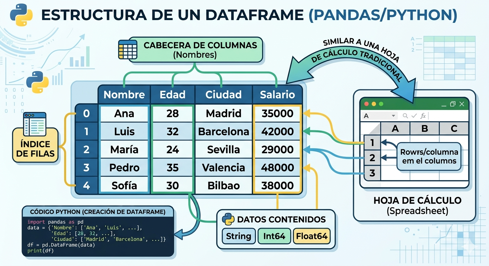
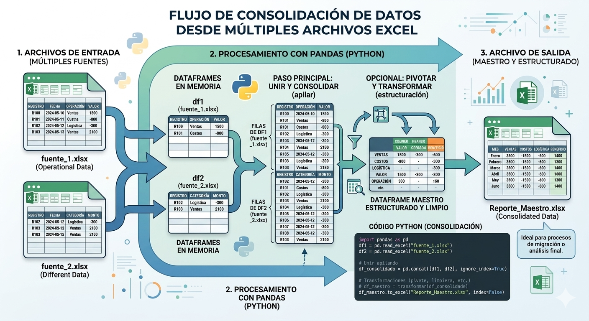
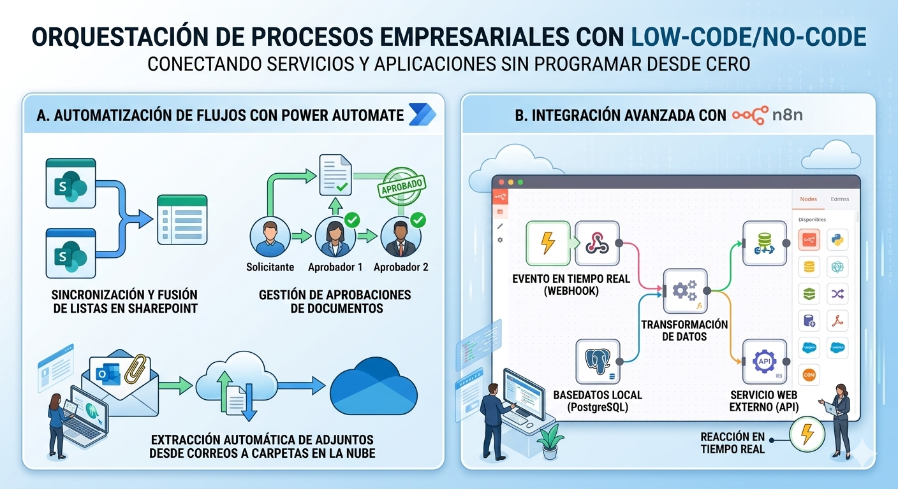
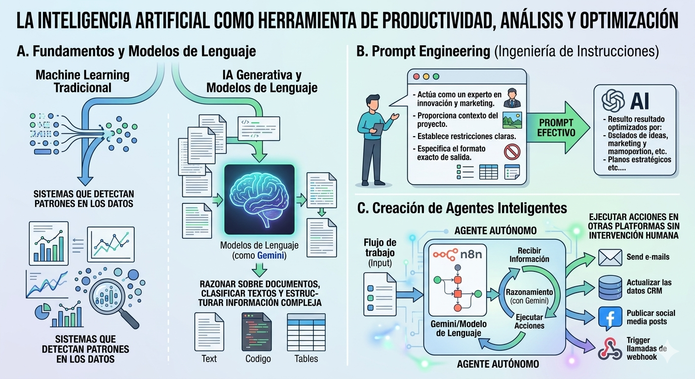

## Unidad 3: Herramientas Computacionales para la Automatización

Esta unidad transiciona de la lógica computacional pura a la aplicación práctica, dotando al estudiante de herramientas tecnológicas modernas para resolver problemas administrativos, automatizar tareas repetitivas y aprovechar el poder de los datos y la inteligencia artificial.

---

### 3.1 Programación básica aplicada a la solución de problemas

En el entorno laboral actual, uno de los retos más comunes es la manipulación volúmenes de datos distribuidos en múltiples archivos. Para resolver esto, utilizaremos **pandas**, la librería estándar para el análisis y transformación de datos en Python.

#### A. Pandas y DataFrames
La estructura de datos principal de esta librería es el **DataFrame**, que funciona exactamente como una tabla bidimensional (con filas y columnas), similar a una hoja de cálculo tradicional.



#### B. Lectura y Manipulación de Archivos
Pandas permite leer, filtrar y limpiar archivos CSV o Excel con muy pocas líneas de código, evitando horas de trabajo manual.

```python
import pandas as pd

# Leer un archivo de Excel
df_ventas = pd.read_excel("ventas_mensuales.xlsx")

# Filtrar: Mostrar solo ventas mayores a 1000
ventas_altas = df_ventas[df_ventas['Total'] > 1000]

# Limpieza: Eliminar filas con celdas vacías
df_limpio = df_ventas.dropna()
```

#### C. Caso Práctico: Consolidación de Múltiples Archivos
Si la información operativa está dividida en varios archivos de Excel separados, podemos unirlos, pivotarlos y transformarlos en un solo archivo maestro estructurado, ideal para procesos de migración o análisis.

```python
import pandas as pd

# 1. Cargar múltiples archivos de Excel
df1 = pd.read_excel("fuente_1.xlsx")
df2 = pd.read_excel("fuente_2.xlsx")

# 2. Consolidar en un solo DataFrame apilando los datos
df_consolidado = pd.concat([df1, df2], ignore_index=True)

# 3. Exportar el resultado a un nuevo archivo
df_consolidado.to_excel("Reporte_Maestro.xlsx", index=False)
print("Consolidación finalizada.")
```



---

### 3.2 Uso de software y herramientas de automatización

No siempre es necesario programar desde cero. Las plataformas "Low-Code/No-Code" permiten orquestar procesos complejos conectando diferentes servicios y aplicaciones empresariales.

#### A. Automatización de flujos con Power Automate
Power Automate es fundamental para gestionar flujos de trabajo corporativos. Permite crear secuencias automatizadas, como la sincronización y fusión de listas en **SharePoint**, la gestión de aprobaciones de documentos, o la extracción automática de archivos adjuntos desde correos electrónicos hacia carpetas en la nube.

#### B. Integración Avanzada con n8n
Para procesos más técnicos que requieren orquestar aplicaciones mediante APIs, **n8n** ofrece un entorno visual avanzado basado en nodos. Permite automatizar la transferencia de datos entre una base de datos local (como PostgreSQL) y un servicio web externo, reaccionando a eventos en tiempo real.



---

### 3.3 Introducción a la inteligencia artificial y aprendizaje automático

La inteligencia artificial (IA) dejó de ser un concepto teórico para convertirse en una herramienta diaria de productividad, análisis y optimización.

#### A. Fundamentos y Modelos de Lenguaje
Es vital comprender la diferencia entre el Machine Learning tradicional (sistemas que detectan patrones en los datos) y la IA generativa. En la actualidad, interactuamos con Modelos de Lenguaje (como **Gemini**), capaces de razonar sobre documentos, clasificar textos y estructurar información compleja.

#### B. Prompt Engineering (Ingeniería de Instrucciones)
El éxito al usar estas herramientas radica en el diseño de las instrucciones. Un buen "prompt" debe proporcionar contexto, definir un rol (por ejemplo, "Actúa como un experto en innovación y marketing"), establecer restricciones claras y especificar el formato exacto de salida.

#### C. Creación de Agentes Inteligentes
El verdadero potencial de la automatización se alcanza al integrar estas tecnologías. Al combinar plataformas de orquestación como n8n con modelos como Gemini, podemos crear **agentes autónomos**. Estos agentes pueden recibir información de un flujo de trabajo, tomar decisiones lógicas basadas en lenguaje natural y ejecutar acciones en otras plataformas sin intervención humana.

